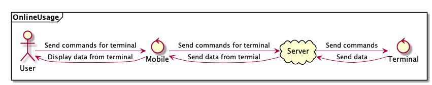
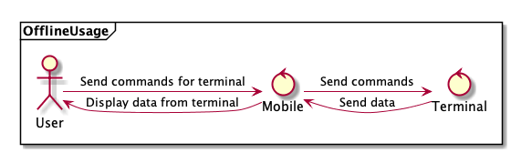

# Описание процесса разработки мобильного приложения Exigner Driver App

## Что нужно и для чего?
Exigner Driver App - приложение для взаимодействия водителей и iOT устройств (Galileosky), установленных в автомобилях.
Требуется онлайн и оффлайн доступ к устройствам.

## Кто уже решил эту задачу?
Из более или менее известных конкурентов среди сферы мониторинга транспорта с мобильным приложением есть только система Wialon.
Оно предоставляет различный функционал по мониторингу, настройке, управлению различными устройствами, в том числе и устройствами Galileosky.
Основным минусом данного приложения является отсутствие оффлайн режима связи с терминалом.
В остальном, данное приложение покрывает все требования к ExignerDriverApp и даже перекрывает их, так как предоставляет подробную отчетность и средства для навигации.

## Как оно будет устроено
   _Disclaimer: Терминал = iOT устройство компании Galileosky_
   Онлайн-режим
   
   
   
   Оффлайн-режим
   
   
   
## Для кого все это?
   _Disclaimer: все описанные ниже портреты - реальные пользователи, сценарии использования которых учитывались при проектировании системы_
   1. **Водитель фуры с рефрижератором.** Человек поздних лет, пользующийся планшетом, встроенным в кабину, из очень бюджетной категории (7 дюймов, 1280x800, 1 gb RAM, Android 7.0 и выше, BLE 4.2, Wi-Fi, GSM). Умеет пользоваться устройством только согласно инструкции, написанной на бумажке, мотивирован получать и оперативно реагировать на информацию с терминала (температура в рефрижераторе, расход топлива), установленного в кабине и рефрижераторе. Обычно, ездит по дорогам с хорошим GSM покрытием.
   2. **Водитель болотохода в тайге.** С интернетом сталкивается, если ночью залазит на самую высокую сосну, смотрит в ночное небо и увидит спутник, либо, если в лагере будут проводить сеанс связи с внешним миром раз в 2 месяца. Боится утонуть в болоте вместе с машиной, поэтому имеет терминал с протоколом Iridium, который может отправлять сигнал SOS диспетчеру. Так же боится остаться без топлива, но плохо умеет в математику и не может спрогнозировать остаток хода по данным из топлива с 4 баков, поэтому получает эту информацию с терминала. Обладает мобильным устройством повышенной защищенности со слабыми характеристиками (как у водителя из пункта 1, но без GSM). Периодически топит/ломает болотоходы, но успевает доставать из них свой планшет и хочет использовать его с другими терминалами. Считает себя уверенным пользователем мобильных устройств.
   3. **Хитрый водитель бразильской Газели.** Молодой человек, бороздящий пустынные бразильские поля на небольшом грузовом автомобиле компании-работодателя. Так как его заработная плата рассчитывается на основе его стиля езды, рассчитываемого с помощью специального алгоритма на терминале, должен постоянно следить за графиком на экране небольшого смартфона (характеристики +- те же, как и у пункта 1), который отображает данные о его текущем стиле езды. Водитель не хочет терять много денег, но любит сливать бензин и знает только 2 положения педали: отпущена и в полу, поэтому постоянно пытается повредить терминал так, чтобы об этом не узнал работодатель. Связь в бразильских полях - явление редкое, но иногда случающееся, поэтому терминал, большую часть времени, подключен по BLE.
   4. **Человек-интегратор.** Занимается настройкой устройств Galileosky для конечных клиентов/организаций, обладает большим количеством различных мобильных устройств из среднего и топового сегмента, постоянно разъезжает по клиентам и настраивает терминалы в онлайн и оффлайн режиме. Хочет иметь максимальный доступ к устройству, вне зависимости от его физического местонахождения, поэтому взаимодействует с терминалами через различные протоколы связи (GSM, BLE, WI-FI).
   5. **Диспетчер.** Человек - "уверенный" пользователь PC. Имеет доступ ко всем устройствам компании и учетным записям водителей. Занимается предоставлением доступа к терминалам водителям. Не имеет непосредственного доступа к устройствам, все настраивает из офиса через web-interface.

## Как это должно выглядеть?
   _Disclaimer: Терминал = iOT устройство компании Galileosky. Дашборд - набор интерактивных виджетов, отображающих информацию о терминале. Источник данных - связка терминал(ы) + дашборд, на котором отображаются данные с этих терминалов_
   - При первом открытии приложения пользователю открывается окно авторизации
   - После прохождения авторизации открывается список источников данных и доступна кнопка меню
   - Если нажать на источник данных, то откроется дашборд связанный с этим источником
   - Если открыть меню, то можно открыть список терминалов, список дашбордов и перейти в оффлайн режим
   - В списке терминалов можно отредактировать данные о привязанных к аккаунту терминалах
   - В списке дашбордов можно отредактировать данные о дашбордах, доступных пользователю и открыть какой-нибудь из дашбордов
   
   Полная карта переходов с картинками расположена по ссылке https://marvelapp.com/e58igfh
   
## Как это реализовать?
   - На чем это будет реализовано?
   > Angular, Cordova, Gomobile.
   - Зачем нужна Cordova, если можно все написать на Java/Kotlin/Swift/Objective-C?
   > Был/есть/будет готовый, объемный, схожий по функционалу код для web-части. А еще были сроки реализации рабочего прототипа - 2 недели, за это время написать с нуля подобный сервис без опыта практически невозможно.
   - Почему Apache Cordova, а не React Native/PhoneGap/Ionic/Xamarin?
   > React Native подразумевает использование кода, написанного с использованием React/желание использовать костыли для рендера кода с помощью React. В нашем случае кодовая база написана на Angular 7, что делает использование React Native - бессмысленным. Xamarin отпадает по схожей причине, пусть TypeScript и похож издалека на C#, но это совершенно разные вещи, особенно в контексте кросс-платформенной веб-разработки. Что касается Apache Cordova vs Adobe PhoneGap vs Ionic, все проекты более или менее подходили под требования, но Adobe PhoneGap - больше мертв, чем жив, а Apache Cordova просто больше понравилась (было найдено меньше проблем с Angular 2).
   - Gomobile = Golang для мобильных устройств. Зачем оно нужно?
   > Причина все та же. Есть готовая, оттестированная, развивающаяся кодовая база, которая написана на Golang и нет возможности/желания переписывать все на малоизвестные языки. Эта часть занимается парсингом данных, передаваемых по бинарному протоколу Galileosky от терминала. Решений было три: написать парсер на JS/TS, так как есть подходящие специалисты, транслировать код на Golang в JS с помощью GopherJS, скомпилировать код на Golang во что-то, что имеет биндинги в Java и интегрировать это что-то в Cordova Plugin. Так как работать с бинарными данными из JS - больно, GopherJS скорее мертв, чем жив, было принято решение компилировать Golang во что-то, что можно использовать из Java. Так как почти все в этом мире можно объединить через биндинги в C, а в мире Golang существовал проект Gomobile, который компилировал Golang код в apk/aar, используя биндинги Go<->C<->Java, выбор был сделан в пользу него.
   - Что можно, а что нельзя сделать с таким стеком?
   > Можно все, но иногда с костылями. Так как Cordova позволяет создавать собственные плагины, которые являются, по сути, встраиваемыми в систему кусками нативного кода, можно выполнять все те же задачи, что и при нативной разработке. 
   - А на чем будет работать такое приложение?
   > Целевая платформа приложения - Android, но можно расширить приложение для обеспечения работоспособности на iOS. В связи с особенностями WebView, минимальная версия системы, на которой приложение работает - Android 5.0, но мы гарантируем работоспособность на устройствах с Android 7.0 и выше.
   - Какие еще ограничения есть?
   > Минимальное поддерживаемое разрешение экрана 800х600. Для работы по Bluetooth нужен BLE не ниже 4.1. Для работы по Wi-Fi нужна возможность создания Wi-Fi сети с мобильного устройства.
   - Как это все вообще работает друг с другом?
   > Существует fronted, который собирается в JS webpack-ом. В этом JS есть вызовы функций из написанного нами Cordova Plugin. Сам же плагин вызывает функции aar-библиотеки, в которую был скомпилирован код на Golang, через описанный интерфейс.
   - А есть какие-нибудь проблемы? Пока что все выглядит слишком хорошо.
   > Так как в приложении есть 3 больших компонента (фронт, плагин и golang-server), это приводит к 3 областям версионирования, и версионирование приложения - довольно нетривиальная задача. Кроме вопросов версионирования существуют проблемы кроссплатформенной разработки, а именно - большое количество специфичного кода, которое попадает в итоговый apk файл и в саму кодовую базу. Так же, такое сложное по устройству приложение предполагает большое количество мест для багов и сложности с автоматическим тестированием.
   - Каким образом выполняется взаимодействие с терминалом?
   > При открытии дашборда в онлайн режиме приложение выполняет запрос на сервер и получает данные с терминала, которые были терминалом на сервер. Эти данные подгружаются в виджеты и пользователь может с ними взаимодействовать. В оффлайн режиме все немного сложнее. При запуске оффлайн режима фронтенд посылает команду запуска локального сервера в плагин, плагин запускает golang сервер и пробрасывает канал связи между сервером и фронтендом. Если терминал подключен по BLE, то плагин перенаправляет пакеты, полученные с помощью Bluetooth API от терминала в сервер. Если устройство подключено по Wi-Fi, то терминал ищет ip-адрес мобильного устройства и отправляет пакеты в порт, открываемый golang-сервером. При переходе в онлайн режим сервер выключается. Так же существует система для сбора логов: логи из всех компонентов передаются в плагин, который выводит их в стандартную систему сбора логов для Android и сохраняет их в памяти устройства.  

## Сколько времени реализовывать?
   _Disclaimer: разработка выполнялась 3 программистами, подсчет времени указан в процентах от общего времени разработки_
   
   |                                      Какой этап?                                      |                                                                                              Что происходит?                                                                                              |                                      Какова цель этапа?                                     |                       Что будет в результате?                      | Сколько времени займет? |
   |:-------------------------------------------------------------------------------------:|:---------------------------------------------------------------------------------------------------------------------------------------------------------------------------------------------------------:|:-------------------------------------------------------------------------------------------:|:------------------------------------------------------------------:|:-----------------------:|
   | Поиск нужной технологии,  проведение экспериментов, анализ существующих решений | Команда ищет технологии, с помощью которых можно решить поставленную задачу. Проводятся поптыки создать работающий прототип, который обладает функциями,  идентичными функциям итогового приложения |                 Понять, можно ли реализовать задачу? Если можно, то как?                 |            Понимание возможностей системы программистами           |            5%           |
   |                         Проектирование архитектуры приложения                         |                                                    Команда проектирует архитектуру приложения, продумывает основные аспекты взаимодействия компонентов                                                    | Создать высокоуровневую структуру приложения. Избавиться от возможных глобальных ошибок. |      Понимание устройства системы, список основных компонентов     |           20%           |
   |                        Разработка отдельных компонентов системы                       |                                            Команда разрабатывает набор не связанных друг с другом компонентов, все зависимости мокаются. Пишутся unit-тесты.                                           |                       Создать и отладить части системы по-отдельности.                      |                  Отлаженные компоненты приложения.                 |           25%           |
   |                     Сбор компонентов приложения в цельную систему                     |                                    Разработанные компоненты интегрируются друг с другом. Отлаживаются связи между компонентами. Создаются интеграционные тесты.                                     |                              Создать тестовый прототип системы                              |             Протоип системы, готовый для тестирования.             |           25%           |
   |     Демонстрация полученной системы, внесение правок, составление документации     |                                 Система демонстрируется заказчикам. Вносятся правки. Пишутся e2e-тесты. Решаются вопросы распространения и поддержки приложения.                                 |          Превратить систему из демонстрационного прототипа в полноценное решение         | Готовое к использованию приложение и инфраструктура вокруг него |           25%           |
   
   
